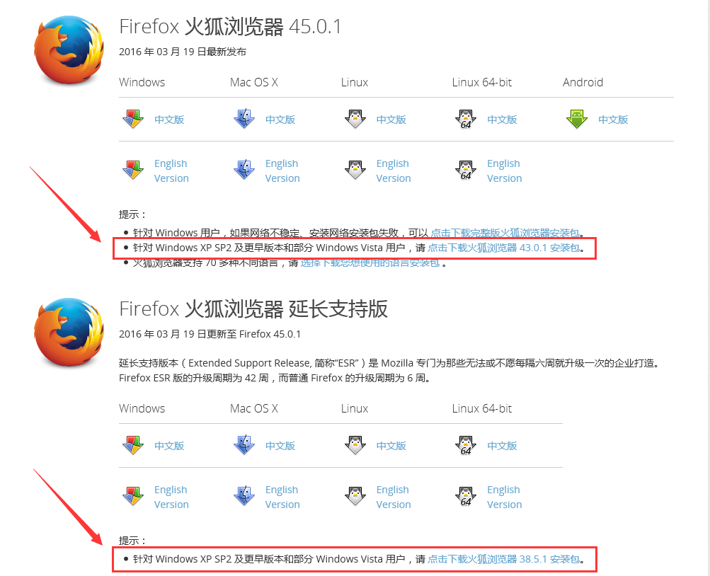
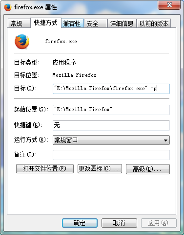
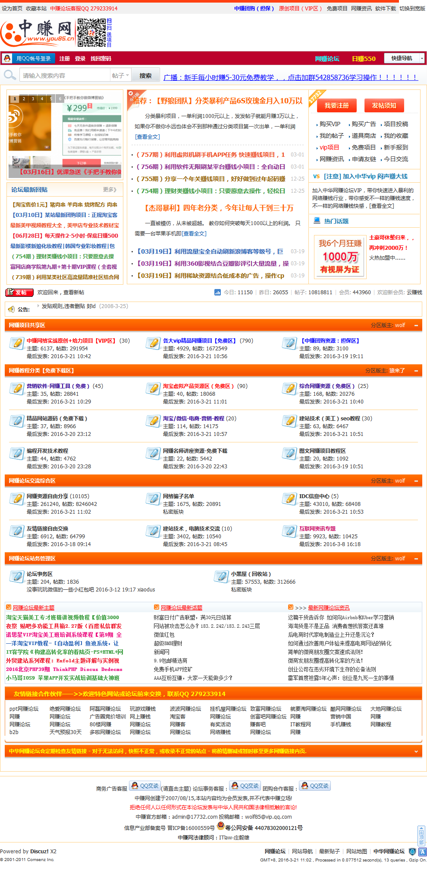
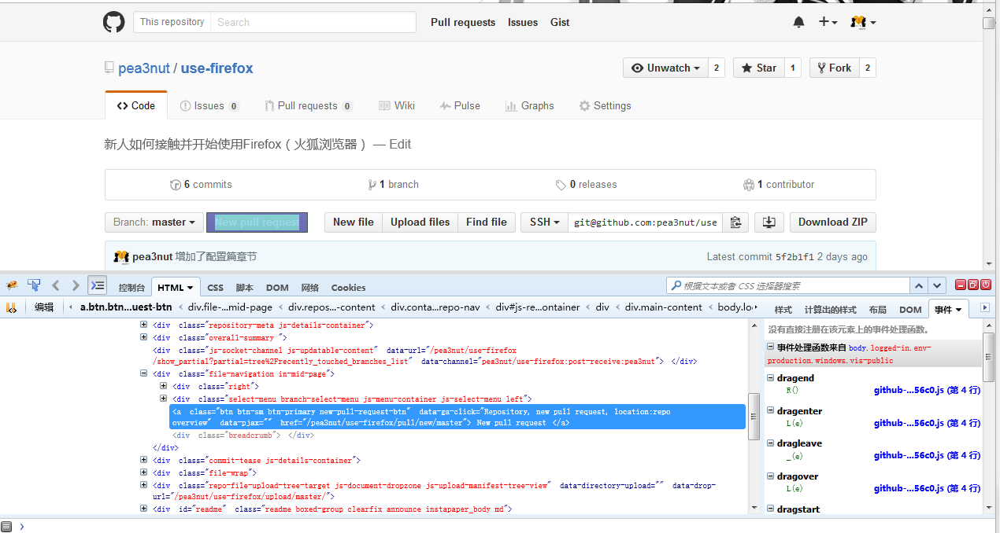
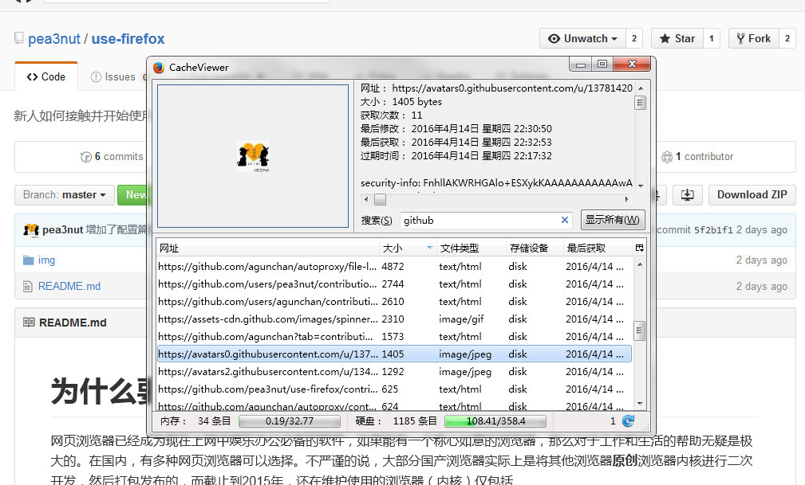

# 为什么要学习使用Firefox？

网页浏览器已经成为现在上网中娱乐办公必备的软件，如果能有一个称心如意的浏览器，那么对于工作和生活的帮助无疑是极大的。在国内，有多种网页浏览器可以选择。不严谨的说，大部分国产浏览器实际上是将其他浏览器**原创**浏览器内核进行二次开发，然后打包发布的，而截止到2015年，还在维护使用的浏览器（内核）仅包括

- 谷歌浏览器 —— Chrome
- 苹果系列浏览器 —— Safari
- 火狐浏览器 —— Firefox
- 微软系列浏览器 —— IE & Edga

Opera浏览器已经将内核换为Chrome内核（Blink）了，而国产浏览器大部分是Chrome+IE双内核。

那么，如果把上面的浏览器必做出行工具，那么差不多就应该是

- 国产浏览器 —— 方便的自动挡车
- Chrome —— 手动挡跑车
- Firefox —— 复杂的改装车

针对一般用户而言，使用国产浏览器可以快速的上手，几乎无需任何配置就可以完成大部分工作，但不会用的很舒服。而Firefox则正相反，如果不进行配置直接使用会有很多的不便，但是如何经过精心的配置，那么会用的非常舒服。

如果你喜欢DIY，想要打造一个“属于”自己的浏览器，那么，Firefox绝对是你的不二之选。

当然，想要配置Firefox也是有一定难度的，不过不要紧，本文会慢慢的帮助你一点点配置好属于你“自己”的Firefox。

# 关于本文

本篇文章会从头开始详细介绍如何使用Firefox（火狐浏览器），帮助新人轻松的从0开始一点点打造一个“属于自己”的强大浏览器。

因为本文原作者水平不高，可能无法充分的介绍出Firefox的威力，欢迎其他的Firefox爱好者一同帮忙完善此文，将我们心爱的Firefox推广给更多的人去使用。

> 一款产品的良心，不在于它对于大部分用户的态度，而是取决于它是否照顾到某一小部分人。

# 安装篇

Firefox有多种版本，首先我们需要选择一款适合自己的版本。

目前针对国内Windows用户来说，除了Mozilla官方提供的版本（国际版），我们还可以选择谋智火狐针对国内环境的优化版的Firefox（中国版）。

- 国际版：https://www.mozilla.org/en-US/firefox/all/
- 中国版：http://www.firefox.com.cn/download/

## 选择国际版还是中国版

### 关于谋智网络

> 成立于2005年3月4日，是Mozilla在中国北京的全资**子公司**，负责Mozilla在华的本地化营销、社区活动和赞助活动

> 北京谋智网络技术有限公司（英语：Beijing Mozilla Online Ltd），又称谋智中国或谋智网络，是一个帮助Mozilla基金会在中国推广和部署其产品的公司。

> 和Mozilla公司类似地，谋智中国是一个由非盈利慈善事业机构（Mozilla基金会）出资创办的商业性公司。

—— 来自维基百科[谋智中国](https://zh.wikipedia.org/wiki/%E8%B0%8B%E6%99%BA%E4%B8%AD%E5%9B%BD)、[Mozilla基金會](https://zh.wikipedia.org/wiki/Mozilla基金會)

所以说，中国版Firefox并不是个人的二次修改版，而是属于Mozilla官方的产品，不必担心某些安全问题。

### 中国版Firefox的缺点

中国版Firefox缺点并不大，据笔者所知，最明显的一点莫过于没有64位的Firefox ESR。如果你选择中国版Firefox ESR，就只能用32位版本的Firefox ESR了。不过这影响并不大，32位的中国版Firefox ESR可以在64位的系统中正常工作。

还有一些其他的小瑕疵，比如到双11购物狂欢节的时候可能会强制添加一个某宝的书签。

### 中国版Firefox的优点

谋智火狐为了帮助Firefox适应中国环境对Firefox做了很多人性化的修改，如中国版特有的许多插件。据笔者所知，最明显的一点莫过于“同步”功能：由于中国大陆独有的防火墙，在访问海外IP时会有诸多问题。因此，谋智公司在国内搭建了一个用于同步的服务器来解决这个问题，并且你也可以随时切换成国际版的同步。

关于缺点，64版本的问题影响也是比较小的，而且64位版本与32位版本除构架外功能也有些不同，可能导致某些问题，性能方面32位的Firefox几乎不会遇到性能的瓶颈。而强制添加书签的情况也很少出现（一年1次左右），并不会影响正常的使用。

### 关于选择的建议

如果在语言方面没有什么障碍的话，建议选择中国版的Firefox。对比那些微不足道的中国版Firefox的缺点，谋智中国专为国内上网环境订制的Firefox各种便利明显要更为实惠一些。

## 关于ESR版（延长支持版）

Firefox一共有3钟更新通道，分别是：

1. 开发版（更新最快，最不稳定）
2. 正式版
3. 稳定版（更新最慢，最稳当）

其中非开发人员不建议选择开发版的Firefox，更新频率太快且不稳定。而正式版（又称曙光版）则是Mozilla默认提供下载的版本，也是本文推荐下载的版本，但是如果在你的工作或生活中浏览器占据一个非常重要的位置，那么你可以选择ESR版。

> 延长支持版本（Extended Support Release, 简称“ESR”）是 Mozilla 专门为那些无法或不愿每隔六周就升级一次的企业打造。Firefox ESR 版的升级周期为 42 周，而普通 Firefox 的升级周期为 6 周。
> —— 引用自[Firefox 火狐浏览器 延长支持版](http://www.firefox.com.cn/download/#download-esr)

- 中国版ESR：http://www.firefox.com.cn/download/#download-esr
- 国际版ESR：https://www.mozilla.org/en-US/firefox/organizations/all/

## 针对 XP SP2 及更早版本的用户

针对 Windows XP SP2 及更早版本的用户，最新版本的Firefox可能无法在你的电脑上正确安装，在各个下载页面可以找到Mozilla针对 Windows XP SP2 及更早版本用户推出的Firefox。

请留意下载页面的文字：

## 其他资料

- 国际版Firefox大全（Mozilla FTP）：http://ftp.mozilla.org/pub/firefox/releases/

# 配置篇

当你通过官网安装完毕Firefox后，在安装根目录下启动`firefox.exe`就可以启动Firefox开始使用了！不过在开始使用，我们需要进行一些配置工作。

## 多版本Firefox共存

很遗憾的是，多版本的Firefox会相互冲突共用一个配置文件，且无法同时启动（即需要关闭其中一个才可启动另一个），这里给出**配置文件冲突**的解决方案。

在Firefox安装目录找到`firefox.exe`并创建一个快捷方式（如果你在安装的时候勾选了“在桌面创建快捷方式”的话，可以直接使用桌面的快捷方式），右键属性设置中选择`快捷方式`选项卡，将光标定位到`目标`中，在路径的最后面添加` -p`（注意-前面有一个空格），如下图

重新启动Firefox，会出现一个管理配置文件的小窗口，选择创建配置文件按钮，按照向导新建一个配置文件，记住创建的配置文件名

在上图中我们新建了一个叫做dev的配置文件。

新建完毕后不要选择启动Firefox，再次打开刚刚设置快捷方式属性的窗口，在` -p`后面添加空格+新建的配置文件名称，如

	"E:\Mozilla Firefox\firefox.exe" -p dev

再次通过快捷方式启动，Firefox就好会自动载入刚刚我们新建的配置文件。

如果你安装了很多版本的Firefox，为了避免冲突，请分别为他们新建不同的配置文件。

## 偏好设置

Firefox提供的丰富的设置选项供用户设置，你可以根据自己的行为偏好来配置Firefox，以下是一些个人偏好设置建议。

### 显示菜单栏和书签工具栏

右键单击Firefox上方标题栏下面的空白，勾选菜单栏和书签工具栏来显示它们，如果你喜欢的话，这非常方便

### 设置网页默认字体

如果你经常在网页中阅读大量的文本，那么你可以打开`菜单栏-工具-选项`来打开配置窗口（或单击右上方的菜单按钮-选项），在左侧选择`内容`，更改一种更方便阅读的字体。推荐Georgia或serif，这能帮你更方便的阅读网页中的内容。

## 使用Firefox同步

这非常重要，拥有Firefox通行证意味着你可以轻松将你数小时完成的配置Firefox工作快速同步到另一台电脑的Firefox中，这非常方便。

打开`菜单栏-工具-同步`创建一个Firefox通行证，然后回到这个窗口，选择你需要同步的内容（推荐不同步历史记录），Firefox会很智能的完成这一切。

Firefox的同步的垮版本的，几乎你在任意版本的配置信息，都可以通过Firefox通行证同步到另一个版本，Firefox会智能的根据当前版本来调整。

同步完记得重启一下.....一切都是那么的熟悉

# 插件篇

这里推荐一下Firefox常用的插件，有些插件可能会涉及到“道德”层面，这里讨论的只是功能。

## 广告拦截插件 —— Adblock Plus

十分强大的广告拦截插件，无需任何配置，安装后即可使用，拦截效果拔群

[某网站](http://www.you85.cn/)开启拦截后

拦截前什么样你们自己打开感受下吧......

## Web调试工具霸主 —— Firebug

几乎不需要什么言语去介绍这款插件，几乎所有的Web开发者都知道这个响当当的大名，说是史上最强大的Web调试工具都不为过。

查看每个DOM元素绑定的JS事件、修改Cookie、查看网络资源加载时间、JavaScript断点调试......实在是太强大

安装后按F12调出Firefox，启用所有面板来Firebug吧！

## 扒缓存党必备 —— CacheViewer

IE时代扒缓存扒的很爽？有了CacheViewer，Firefox照样扒！

安装后在`菜单-工具-Web开发者-有了CacheViewer`调出窗口，支持搜索与多种排序，方便快捷的找到你心仪的那个缓存~

## 网银必备 / 双核调试 —— 解雇IE

## Flash小窗口弹出 —— PopVideo

## 快捷缩放工具 —— Default Full Zoom Level

## 批量下载神器 —— DownThemAll!

## 下载网页视频 —— Flash Video Downloader

## 便利的JavaScript运行插件 —— InheritPrincipal

## 多行书签插件 —— Multirow Bookmarks Toolbar Plus

## 迅雷等第三方下载工具支持 —— xThunder