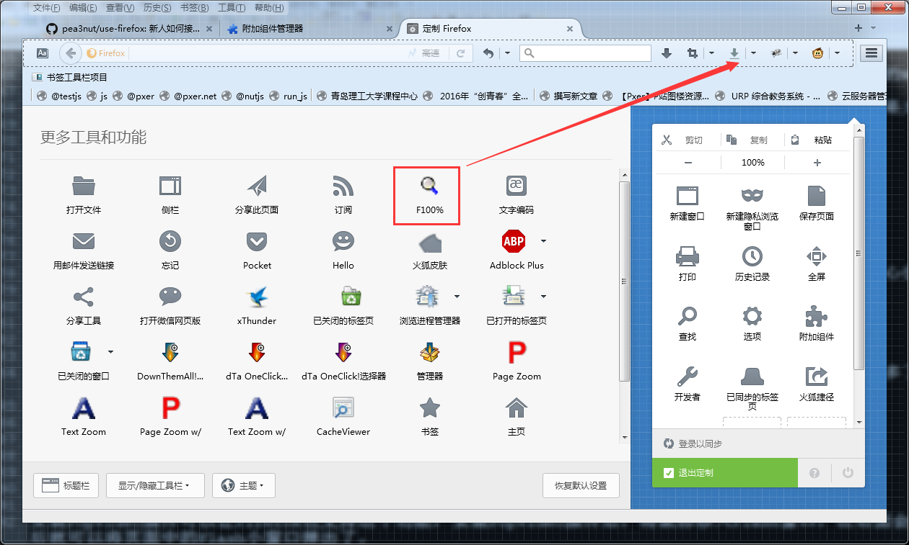
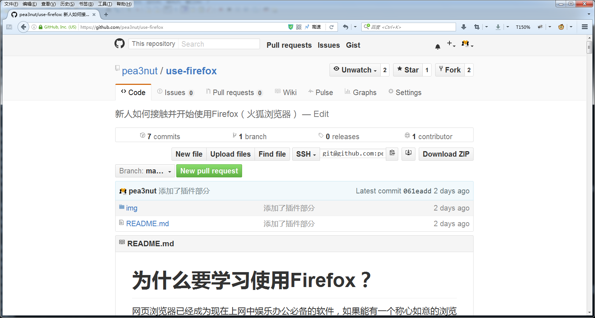
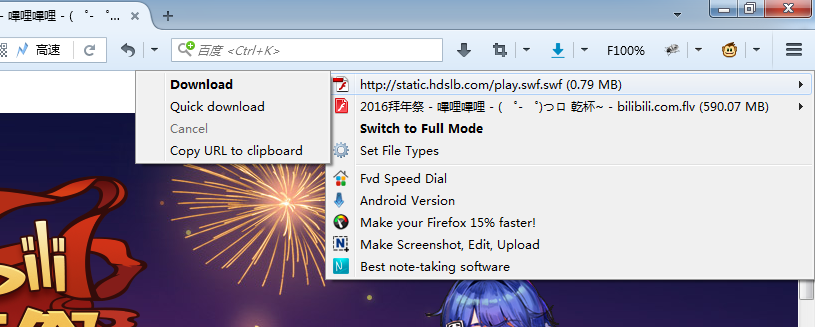
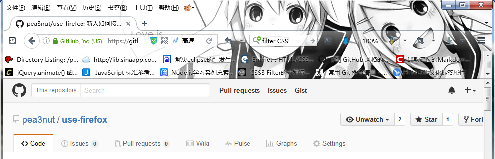
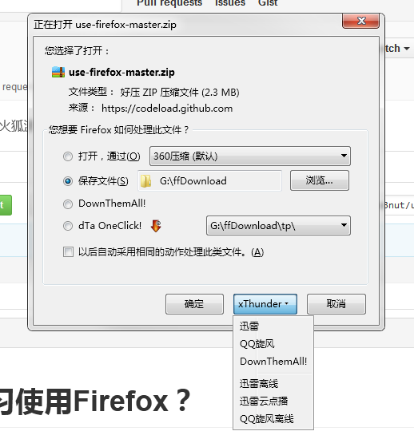
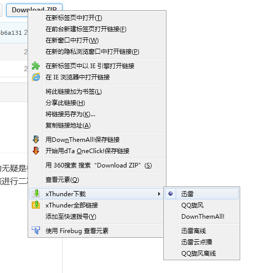
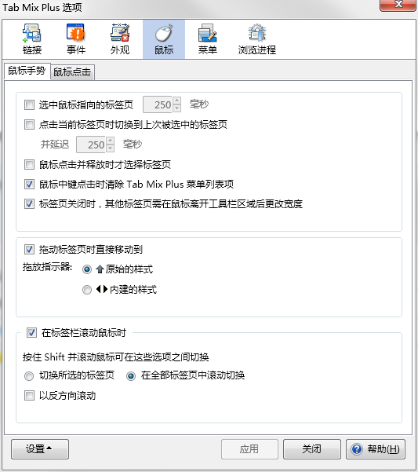

# 引言

## 关于浏览器的常识

网页浏览器已经成为现在上网中娱乐办公必备的软件，如果能有一个称心如意的浏览器，那么对于工作和生活的帮助无疑是极大的。在国内，有多种网页浏览器可以选择。不严谨的说，大部分国产浏览器实际上是将其他浏览器**原创**浏览器内核进行二次开发，然后打包发布的，而截止到2015年，还在维护使用的浏览器（内核）仅包括

- 谷歌浏览器 —— Chrome
- 苹果系列浏览器 —— Safari
- 火狐浏览器 —— Firefox
- 微软系列浏览器 —— IE & Edga

Opera浏览器已经将内核换为Chrome内核（Blink）了，而国产浏览器大部分是Chrome+IE双内核。

## Firefox是否适合我

那么，如果把的浏览器比作出行工具，那么差不多就应该是

- 国产浏览器 —— 方便的自动挡车
- Chrome —— 手动挡跑车
- Firefox —— 复杂的改装车

针对一般用户而言，使用国产浏览器可以快速的上手，几乎无需任何配置就可以完成大部分工作，但不会用的很舒服。而Firefox则正相反，如果不进行配置直接使用会有很多的不便，但是如何经过精心的配置，那么会用的非常舒服。

说实话，Firefox并不适合无**任何**电脑基础的人群使用，如果你几乎没有接触过电脑，或是不经常使用浏览器，不想在配置浏览器上花费时间，那么可能Firefox不适合你。但是如果你富有冒险精神，喜欢DIY，经常使用浏览器，想要打造一个“属于”自己的浏览器，那么，Firefox绝对是你的不二之选。

## 我能受到哪些受益

如果你熟练的使用Firefox，它可以帮助你完成很多事情，通过形形色色的插件来订制自己想要的功能，这不仅很酷，也很实用。

Firefox可以提高你浏览网页的**效率**和**舒适度**。

而因为Firefox是所有浏览器订制最自由的，所有配置Firefox也会是所有浏览器中最复杂的，这可能会花一些时间。

拿出一些耐心，本文会慢慢的帮助你一点点配置好属于你“自己”的Firefox。

# 关于本文

本篇文章会从头开始详细介绍如何使用Firefox（火狐浏览器），帮助新人轻松的从0开始一点点打造一个“属于自己”的强大浏览器。

因为本文原作者水平不高，可能无法充分的介绍出Firefox的威力，欢迎其他的Firefox爱好者一同帮忙完善此文，将我们心爱的Firefox推广给更多的人去使用。

> 一款产品的良心，不在于它对于大部分用户的态度，而是取决于它是否照顾到某一小部分人。

# 安装篇

Firefox有多种版本，首先我们需要选择一款适合自己的版本。

目前针对国内Windows用户来说，除了Mozilla官方提供的版本（国际版），我们还可以选择谋智火狐针对国内环境的优化版的Firefox（中国版）。

- 国际版：https://www.mozilla.org/en-US/firefox/all/
- 中国版：http://www.firefox.com.cn/download/

## 选择国际版还是中国版

### 关于谋智网络

> 成立于2005年3月4日，是Mozilla在中国北京的全资**子公司**，负责Mozilla在华的本地化营销、社区活动和赞助活动

> 北京谋智网络技术有限公司（英语：Beijing Mozilla Online Ltd），又称谋智中国或谋智网络，是一个帮助Mozilla基金会在中国推广和部署其产品的公司。

> 和Mozilla公司类似地，谋智中国是一个由非盈利慈善事业机构（Mozilla基金会）出资创办的商业性公司。

—— 来自维基百科[谋智中国](https://zh.wikipedia.org/wiki/%E8%B0%8B%E6%99%BA%E4%B8%AD%E5%9B%BD)、[Mozilla基金會](https://zh.wikipedia.org/wiki/Mozilla基金會)

所以说，中国版Firefox并不是个人的二次修改版，而是属于Mozilla官方的产品，不必担心某些安全问题。

### 中国版Firefox的缺点

中国版Firefox缺点并不大，据笔者所知，最明显的一点莫过于没有64位的Firefox ESR。如果你选择中国版Firefox ESR，就只能用32位版本的Firefox ESR了。不过这影响并不大，32位的中国版Firefox ESR可以在64位的系统中正常工作。

还有一些其他的小瑕疵，比如到双11购物狂欢节的时候可能会强制添加一个某宝的书签。

### 中国版Firefox的优点

谋智火狐为了帮助Firefox适应中国环境对Firefox做了很多人性化的修改，如中国版特有的许多插件。据笔者所知，最明显的一点莫过于“同步”功能：由于中国大陆独有的防火墙，在访问海外IP时会有诸多问题。因此，谋智公司在国内搭建了一个用于同步的服务器来解决这个问题，并且你也可以随时切换成国际版的同步。

关于缺点，64版本的问题影响也是比较小的，而且64位版本与32位版本除构架外功能也有些不同，可能导致某些问题，性能方面32位的Firefox几乎不会遇到性能的瓶颈。而强制添加书签的情况也很少出现（一年1次左右），并不会影响正常的使用。

### 关于选择的建议

如果在语言方面没有什么障碍的话，建议选择中国版的Firefox。对比那些微不足道的中国版Firefox的缺点，谋智中国专为国内上网环境订制的Firefox各种便利明显要更为实惠一些。

## 关于ESR版（延长支持版）

Firefox一共有3钟更新通道，分别是：

1. 开发版（更新最快，最不稳定）
2. 正式版
3. 稳定版（更新最慢，最稳当）

其中非开发人员不建议选择开发版的Firefox，更新频率太快且不稳定。而正式版（又称曙光版）则是Mozilla默认提供下载的版本，也是本文推荐下载的版本，但是如果在你的工作或生活中浏览器占据一个非常重要的位置，那么你可以选择ESR版。

> 延长支持版本（Extended Support Release, 简称“ESR”）是 Mozilla 专门为那些无法或不愿每隔六周就升级一次的企业打造。Firefox ESR 版的升级周期为 42 周，而普通 Firefox 的升级周期为 6 周。
> —— 引用自[Firefox 火狐浏览器 延长支持版](http://www.firefox.com.cn/download/#download-esr)

- 中国版ESR：http://www.firefox.com.cn/download/#download-esr
- 国际版ESR：https://www.mozilla.org/en-US/firefox/organizations/all/

## 针对 XP SP2 及更早版本的用户

针对 Windows XP SP2 及更早版本的用户，最新版本的Firefox可能无法在你的电脑上正确安装，在各个下载页面可以找到Mozilla针对 Windows XP SP2 及更早版本用户推出的Firefox。

请留意下载页面的文字：

## 其他资料

- 全球版Firefox大全（Mozilla FTP）：http://ftp.mozilla.org/pub/firefox/releases/

# 配置篇

当你通过官网安装完毕Firefox后，在安装根目录下启动`firefox.exe`就可以启动Firefox开始使用了！不过在开始使用，我们需要进行一些配置工作。

## 多版本Firefox共存

很遗憾的是，多版本的Firefox会相互冲突共用一个配置文件，且无法同时启动（即需要关闭其中一个才可启动另一个），这里给出**配置文件冲突**的解决方案。

在Firefox安装目录找到`firefox.exe`并创建一个快捷方式（如果你在安装的时候勾选了“在桌面创建快捷方式”的话，可以直接使用桌面的快捷方式），右键属性设置中选择`快捷方式`选项卡，将光标定位到`目标`中，在路径的最后面添加` -p`（注意-前面有一个空格），如下图

重新启动Firefox，会出现一个管理配置文件的小窗口，选择创建配置文件按钮，按照向导新建一个配置文件，记住创建的配置文件名

在上图中我们新建了一个叫做dev的配置文件。

新建完毕后不要选择启动Firefox，再次打开刚刚设置快捷方式属性的窗口，在` -p`后面添加空格+新建的配置文件名称，如

	"E:\Mozilla Firefox\firefox.exe" -p dev

再次通过快捷方式启动，Firefox就好会自动载入刚刚我们新建的配置文件。

如果你安装了很多版本的Firefox，为了避免冲突，请分别为他们新建不同的配置文件。

## 偏好设置

Firefox提供的丰富的设置选项供用户设置，你可以根据自己的行为偏好来配置Firefox，以下是一些个人偏好设置建议。

### 显示菜单栏和书签工具栏

右键单击Firefox上方标题栏下面的空白，勾选菜单栏和书签工具栏来显示它们，如果你喜欢的话，这非常方便

### 设置网页默认字体

如果你经常在网页中阅读大量的文本，那么你可以打开`菜单栏-工具-选项`来打开配置窗口（或单击右上方的菜单按钮-选项），在左侧选择`内容`，更改一种更方便阅读的字体。推荐Georgia或serif，这能帮你更方便的阅读网页中的内容。

## 使用Firefox同步

这非常重要，拥有Firefox通行证意味着你可以轻松将你数小时完成的配置Firefox工作快速同步到另一台电脑的Firefox中，这非常方便。

打开`菜单栏-工具-同步`创建一个Firefox通行证，然后回到这个窗口，选择你需要同步的内容（推荐不同步历史记录），Firefox会很智能的完成这一切。

> 注意，中国版和全球版账号不通用！

Firefox的同步的垮版本的，几乎你在任意版本的配置信息，都可以通过Firefox通行证同步到另一个版本，Firefox会智能的根据当前版本来调整。

同步完记得重启一下.....一切都是那么的熟悉

# 插件篇

这里推荐一下Firefox常用的插件，有些插件可能会涉及到“道德”层面，这里讨论的只是功能。

如果要安装插件，可以选择`菜单-工具-附加组件`打开安装窗口，在右上角的搜索栏直接输入插件名称搜索即可，需要注意的是，搜索有2中方式，分别是搜索“我的附加组件”和“可用附加组件”，已安装的插件将不会再出现在“可用附加组件”中。

本篇介绍的插件合集已添加至整理至Mozilla附加组件收藏集

	https://addons.mozilla.org/zh-cn/firefox/collections/%E8%8A%B1%E7%94%9FPeA/favorites/

## 广告拦截插件 —— Adblock Plus

十分强大的广告拦截插件，无需任何配置，安装后即可使用，拦截效果拔群

[某网站](http://www.you85.cn/)开启拦截后

拦截前什么样你们自己打开感受下吧......

## Web调试工具霸主 —— Firebug

几乎不需要什么言语去介绍这款插件，几乎所有的Web开发者都知道这个响当当的大名，说是史上最强大的Web调试工具都不为过。

查看每个DOM元素绑定的JS事件、修改Cookie、查看网络资源加载时间、JavaScript断点调试......实在是太强大

安装后按F12调出Firefox，启用所有面板来Firebug吧！

## 扒缓存党必备 —— CacheViewer

IE时代扒缓存扒的很爽？有了CacheViewer，Firefox照样扒！

安装后在`菜单-工具-Web开发者-CacheViewer`调出窗口，支持搜索与多种排序，方便快捷的找到你心仪的那个缓存~

## 网银必备 / 双核调试 —— 解雇IE

还在羡慕国产浏览器可以双核无缝切换？Firefox照样也可以，安装“解雇IE”插件后，你会发现在地址栏多了一个“高速”按钮，说明现在在使用的是Firefox原带的内核（Gecko），点击后会切换到兼容视图，此时使用的IE内核。

使用IE内核可以登录网上银行，或者打开某些古老的网站，方便快捷。

## Flash小窗口弹出 —— PopVideo

部分浏览器（如UC浏览器）可以将页面中的Flash小窗口弹出，这一点在看视频的时候比较有用。

安装PopVideo插件可以让Firefox也支持这个功能，安装PopVideo插件后，将鼠标移入Flash窗口，在右面会有一个蓝色的小相机标志，点击后就可以将页面中的Flash小窗口弹出了。

## 快捷缩放工具 —— Default Full Zoom Level

这个插件可以十分方便的缩放网页，并且还提供了一种特殊的缩放 —— 仅缩放文本，如果你经常使用浏览器来阅读，或是你的显示器比较特殊，这个插件十分有效。

安装插件后，在Firefox定制中将插件拖动到主面板中

单机主面板中的插件可以选择缩放比例，右击可以切换缩放模式。

下面是正常的150%网页缩放，也是Firefox和本插件的默认方式（F模式）

本插件还提供了一种仅文本缩放（T模式），下图是仅文本缩放150%

2种缩放在不同的情况相当有效，配合起来可以显著的提供屏幕阅读。

## 下载增强插件 —— Download Manager Tweak

说实话，Firefox自带的下载挺简（幼）洁（稚）的，本插件就可以大大的扩展Firefox下载功能，提供很多便利操作和更多的高级配置。

## 批量下载神器 —— DownThemAll!

超强的多线程下载器，几乎可以满足所有的下载要求，不折不扣的神器！

安装后可以在Firefox定制窗口中将本插件的组件拖动到主面板，插件提供多种组件来满足不同人群不同的需求。

## 下载网页视频 —— Flash Video Downloader

嘿嘿嘿，如果你经常使用网页看视频并想下载下来，那么这个软件可以帮到你。

安装完毕后，安装后可以在Firefox定制窗口中将本插件的组件拖动到主面板，当打开一个有视频的网页时，插件会变蓝来告诉你：这个网页有视频可以下载

## 便利的JavaScript运行插件 —— InheritPrincipal

如果你是一个JavaScript开发者，那么这一款插件或许会适合你。

安装InheritPrincipal插件后，你可以直接在地址栏输入前导的`javascript:`+想要运行的JS代码就可以运行。

## 多行书签插件 —— Multirow Bookmarks Toolbar Plus

啊哈，如果你的书签非常多的时候，这个插件就派上大用场了。

本插件可以大大的扩展Firefox的书签栏功能，支持多种高级设置，最重要的是，它可以让你的Firefox显示2排书签！是不是非常棒？

## 迅雷等第三方下载工具支持 —— xThunder

几乎是国内上网必备，除非你不用第三方下载工具（如迅雷）。

此插件不仅可以让Firefox支持迅雷下载，还可以破解特定下载工具的下载地址，使用Firefox内置的下载器来下载。

安装后，当再次弹出下载框，就多了一个xThunder按钮，点击后就可以使用第三方下载工具了！

如果发现下载不正常，可以右击下载地址直接选择xThunder。

## 标签页加强 —— Tab Mix Plus

本插件可以大大增强Firefox标签页功能，充分满足DIY玩家的需求。

Tab Mix Plus提供的各种扩展设置可以让你眼花缭乱！

## 大名鼎鼎的油猴子 —— Greasemonkey

如果你不是一名开发者，为了你的安全着想，建议你不要安装此插件。

不严谨的说，此插件相当于是一个插件管理，安装油猴子以后，你可以为你的Firefox安装另一种种类的插件（JS代码），但是由于另一种种类的插件没有Mozilla审核，可能会有比较严重的安全隐患！

## 官方主题插件 —— Personas Plus

Personas Plus可以让你很方便的更换、订制主题。

Firefox拥有数以万计的主题供用户选择，不仅如此，你还有根据自己的想法去更改主题！

在定制面板中将Personas Plus图标（一个小狐狸头像）退拽到主面板，你就可以十分方便的随时切换主题了。